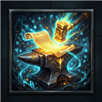
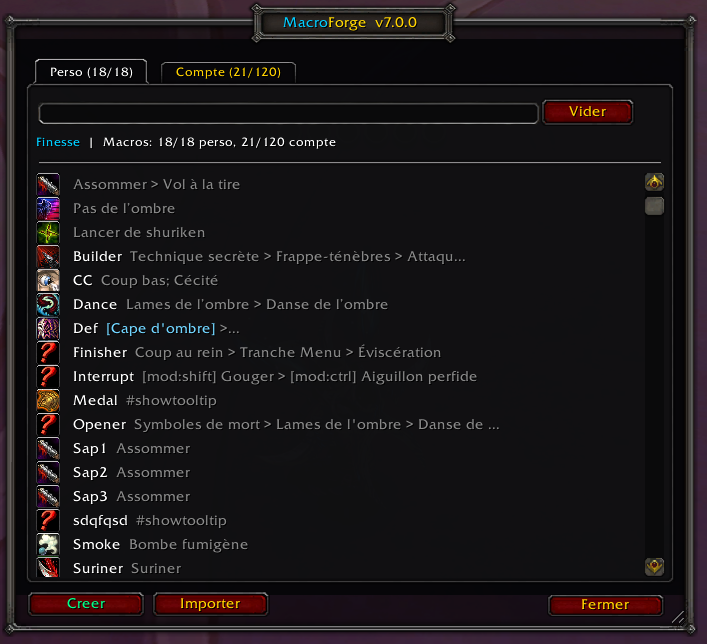
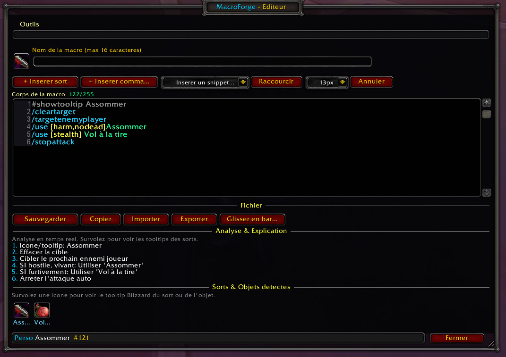
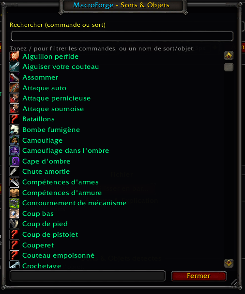
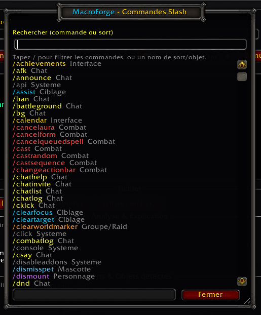

<p align="center">
  
</p>

<h1 align="center">MacroForge</h1>

<p align="center">
  <strong>The macro editor that WoW should have shipped with.</strong><br/>
  <sub>Write smarter macros, faster — with real-time analysis, autocomplete, syntax highlighting,<br/>and a full toolkit built for serious players.</sub>
</p>

<p align="center">
  
  
  
  
</p>

<p align="center">
  <a href="#-installation">📦 Install</a> •
  <a href="#-features-at-a-glance">✨ Features</a> •
  <a href="#-slash-commands">📝 Commands</a> •
  <a href="#-screenshots">🖼️ Screenshots</a>
</p>

---

## 💡 Why MacroForge?

WoW's built-in macro editor is a **plain text box**. No syntax checking. No autocomplete. No way to know if your macro is broken until you press it mid-pull and nothing happens.

**MacroForge changes that.**

It gives you a **real** editor — syntax highlighting, live error detection, spell verification from your spellbook, intelligent autocomplete, one-click templates for every class, and a visual condition builder that makes `[mod:shift,@focus,harm,nodead]` feel effortless.

Whether you're a **Mythic raider** optimizing cooldown sequencing, a **PvP player** chaining arena macros, a **healer** perfecting mouseover casts, or someone writing their very first `/cast` — MacroForge has your back.

> **TL;DR** — It's like having an IDE for WoW macros. Inside WoW.

---

## ✨ Features at a Glance

| Feature | Description |
|---------|-------------|
| 🔍 **Real-Time Analyzer** | Live validation of commands, conditions & spell names as you type |
| 🎨 **Syntax Highlighting** | Color-coded commands, conditions, spells, items & errors |
| ⌨️ **Smart Autocomplete** | Context-aware suggestions for `/commands`, `[conditions]` & spells |
| 🧩 **Condition Builder** | Visual dropdown UI to compose conditions — no syntax memorization |
| 📋 **40+ Templates** | Ready-to-use macros for every class, role & situation |
| ✂️ **Macro Shortener** | Compress macros to save characters (255 limit) intelligently |
| 🔗 **Share & Send** | Export/import codes + send macros directly to online players |
| 📖 **Spell Browser** | Full spellbook with icons — search and insert any spell instantly |
| 🎯 **Command Palette** | All slash commands categorized and searchable |
| 💾 **Spec Profiles** | Per-specialization macro sets with auto-swap on spec change |
| 🔄 **Backup & History** | Up to 10 backups + undo/redo per macro |
| 🔎 **Duplicate Detector** | Find and clean up duplicate macros |
| 🌐 **Localization** | English & French |

---

## 🖼️ Screenshots

<table>
  <tr>
    <td align="center"><strong>📋 Macro Manager</strong></td>
    <td align="center"><strong>✏️ Smart Editor</strong></td>
  </tr>
  <tr>
    <td></td>
    <td></td>
  </tr>
  <tr>
    <td align="center"><strong>🔮 Spell Browser</strong></td>
    <td align="center"><strong>⚡ Command Palette</strong></td>
  </tr>
  <tr>
    <td></td>
    <td></td>
  </tr>
</table>

---

## 🔍 Deep Dive

### Real-Time Macro Analyzer

Your macros are validated **live** — every command, condition, and spell is checked against WoW's slash command database and your actual spellbook.

- **Instant error detection** — Unknown commands, invalid conditions, and unverified spells are flagged immediately
- **"Did you mean?"** — Typo in `/csatsequence`? MacroForge suggests `/castsequence` via Levenshtein fuzzy matching
- **Macro health score** — Each macro gets a 0–100% quality rating so you spot problems at a glance
- **Line-by-line explanations** — Plain-English breakdown of what each line actually does

### Context-Aware Autocomplete

MacroForge knows *where* your cursor is and suggests accordingly:

```
/           → slash commands with categories
[           → conditions (@target, help, harm, mod:shift…)
/cast [...]  → spells from YOUR spellbook, with icons
```

Navigate with **↑ ↓ Tab Enter** — full keyboard control, no mouse needed.

### Visual Condition Builder

Build complex condition blocks visually:

```
Target:     [@mouseover]     ← dropdown
Condition:  [help]           ← dropdown  
Condition:  [nodead]         ← dropdown
Modifier:   [mod:shift]      ← dropdown + sub-dropdown

Preview:    [@mouseover,help,nodead,mod:shift]
```

One click to insert directly into your macro. Supports **all** WoW conditionals — targets, modifiers, stances, specs, talents, forms, groups, buttons, and more.

### 40+ Class Templates

Every template is battle-tested and organized by role:

| Category | Examples |
|----------|----------|
| **Universal** | Mouseover cast, modifier combos, mount macro, trinket usage, cast sequences |
| **Interrupt** | Focus > Mouseover > Target priority chains for every class |
| **Offensive** | Stealth openers, burst sequencing, startattack combos |
| **Defensive** | Bubble+cancel, Evasion/Cloak combos, defensive CD stacking |
| **CC** | Smart CC (stealth=Cheap Shot, else Blind), Polymorph focus, trap @cursor |
| **Healer** | Mouseover heal chains, smart dispels, emergency self-heal |
| **Tank** | Mouseover taunt, defensive modifier macros |
| **PvP** | Arena1/2/3 targeting, PvP trinket |

Auto-detects your class and highlights relevant templates alongside universal ones.

### Macro Shortener

Hitting the **255-character limit**? One click to compress:

```diff
- /castsequence [mod:shift] reset=target Spell One, Spell Two, Spell Three
+ /castse [mod:shift]reset=target Spell One,Spell Two,Spell Three
  ↳ Saved 13 characters
```

Uses shortest command aliases, strips whitespace inside conditions, removes redundant spaces — all while respecting WoW's syntax specification. **Only safe transformations are applied.**

### Share, Import & Send

- **Export** → Generates a compressed code string (LibDeflate + AceSerializer) for Discord, forums, guild chat
- **Import** → Paste a code, get a live preview with syntax highlighting, create or edit in one click
- **Direct send** → Type a player name, macro arrives as an in-game popup via AceComm
- **Legacy support** → Reads MF5, MF6, and MF7 format codes

---

## 📦 Installation

1. **Download** the [latest release](https://github.com/kriffin/MacroForge/releases) or clone:
   ```bash
   git clone https://github.com/kriffin/MacroForge.git
   ```
2. **Copy** the `MacroForge` folder into:
   ```
   World of Warcraft/_retail_/Interface/AddOns/
   ```
3. **Reload** — restart WoW or type `/reload` in-game

> **Tip:** Type `/mf` in chat to open MacroForge. That's it.

---

## 📝 Slash Commands

| Command | Description |
|---------|-------------|
| `/mf` | Toggle the main window |
| `/mf analyze` | Run analysis on all macros |
| `/mf builder` | Open the visual condition builder |
| `/mf commands` | Open the slash command palette |
| `/mf templates` | Browse macro templates |
| `/mf share` | Export the current macro |
| `/mf import` | Import a macro from a code |
| `/mf send` | Send a macro to another player |
| `/mf duplicates` | Detect duplicate macros |
| `/mf save` / `load` | Save/load spec profiles |
| `/mf backup` / `restore [n]` | Backup/restore macros |
| `/mf settings` | Open settings panel |
| `/mf help` | Show all commands |

---

## ⚙️ Configuration

MacroForge integrates into WoW's **Interface → AddOns** settings panel, or access via `/mf settings`:

- **Editor font & size** — LibSharedMedia support for custom fonts
- **Syntax coloring** — Toggle color-coded highlighting
- **Auto-save drafts** — Never lose work in progress
- **Sound effects** — Audio feedback for actions
- **Minimap button** — Show/hide toggle
- **Keybindings** — Bind keys to toggle editor, builder, etc.
- **Backup depth** — Configure max backup & history slots

---

## 🏗️ Built With

| Library | Purpose |
|---------|---------|
| [Ace3](https://www.wowace.com/projects/ace3) | Full addon framework — AceAddon, AceDB, AceEvent, AceGUI, AceConfig, AceConsole, AceComm, AceSerializer, AceHook, AceTimer, AceLocale |
| [LibDeflate](https://github.com/SafeteeWoW/LibDeflate) | Data compression for sharing codes |
| [LibDataBroker](https://github.com/tekkub/libdatabroker-1-1) + [LibDBIcon](https://www.wowace.com/projects/libdbicon-1-0) | Minimap button integration |
| [LibSharedMedia](https://www.wowace.com/projects/libsharedmedia-3-0) | Custom font support |

---

## 📄 License

[MIT](LICENSE) — Use it, fork it, improve it.

---

<p align="center">
  <br/>
  <strong>Stop writing macros blind. Start forging them.</strong><br/>
  <sub>Made with ❤️ by Antigravity</sub>
</p>
