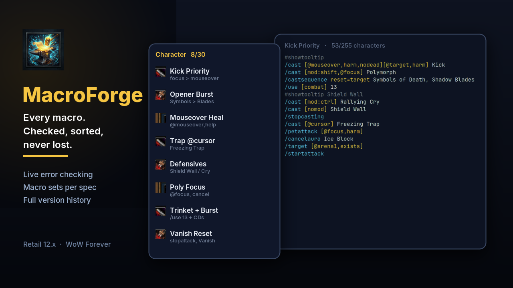
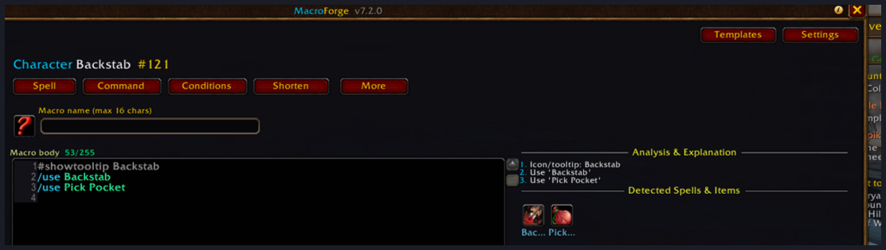
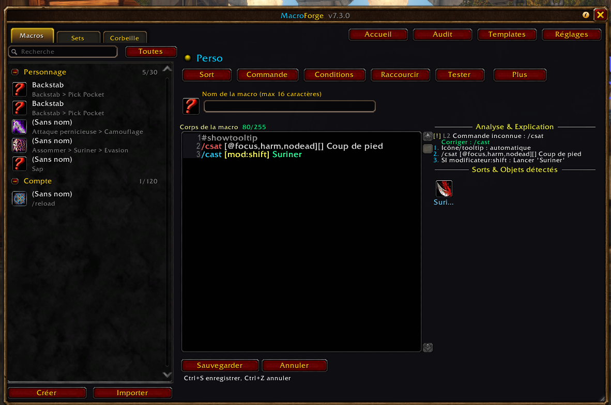
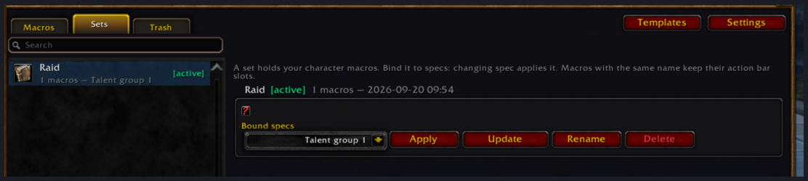
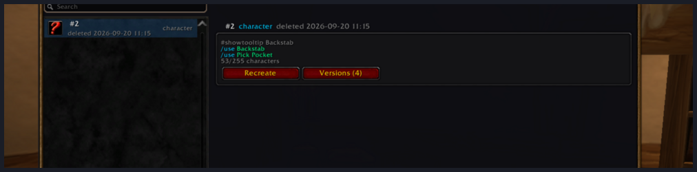

<p align="center">
  
</p>

<p align="center">
  <a href="https://www.curseforge.com/wow/addons/macroforge"></a>
  
  
  
</p>

## Your macro is broken. You will find out mid-pull.

No syntax check. No spell verification. No history. Blizzard's macro frame is a text box, and it has been for twenty years.

**MacroForge is the editor that should have shipped with the game.** It checks every line as you type, tells you what your macro would do *right now*, keeps every version you ever saved, and swaps whole macro sets when you change spec — without emptying your action bars.



---

## It catches the mistake before the boss does

- **Live analysis** — every command, condition and spell checked against your own spellbook
- **"Did you mean…?"** — `/csatsequence` becomes `/castsequence`, a misspelt spell gets the closest match
- **Plain-English explanation** of every line, right next to the code
- **Test button** — resolves the macro against your current state: which clause fires, on which target, or nothing at all. Hold Shift to test your Shift branch
- **Live 255-character counter**, with the shortener one click away

## One window, built for speed

Search by name **or content**. Filter to what is broken, what sits on a bar, what nobody uses. Drag a macro straight onto your action bars. Right-click for duplicate, share, move between Character and Account, or its full history.

`Ctrl+S` save · `Ctrl+Z` undo · `Ctrl+F` search · `↑ ↓` walk the list · `Del` delete



## Your macros follow your spec

Save your character macros as a **set** — Raid, M+, PvP, whatever you run. Bind it to a spec. Change spec, and the right set is in place before the pull. Macros that exist in both sets **keep their action bar slots**, and anything you changed is saved into the set before it swaps.



## Nothing is ever lost

- **Every version of every macro** is kept — including the edits you make in Blizzard's own frame
- Deleted a macro? It is in the **Trash**, body intact, one click from coming back
- **Automatic backup** before every set swap or restore
- Unsaved changes are marked, and MacroForge asks before dropping them



## Also in the box

**50+ class templates** — interrupt chains, stealth openers, defensive stacks, mouseover heals, arena targeting. Spell names are resolved from spell IDs, so they are always in the client's language.

**Audit** — one panel listing every macro that needs attention, worst first.

**Share** — export a macro as a short code (LibDeflate + AceSerializer), or send it straight to another MacroForge user in game.

**Condition builder** — build `[@mouseover,harm,nodead]` from dropdowns instead of memorising it.

---

## Install

**With the CurseForge app** — search for *MacroForge*, or use the [project page](https://www.curseforge.com/wow/addons/macroforge).

**By hand** — download a [release](https://github.com/kriffin/MacroForge/releases) and drop the `MacroForge` folder into:

```
World of Warcraft/_retail_/Interface/AddOns/        # Retail 12.x
World of Warcraft/_classic_beta_/Interface/AddOns/  # WoW Forever
```

Then type `/mf` in game, or click the minimap button.

| Command | What it does |
|---|---|
| `/mf` | Open / close MacroForge |
| `/mf sets` | Macro sets |
| `/mf audit` | Check every macro |
| `/mf templates` | Class templates |
| `/mf import` · `/mf export` | Share codes |
| `/mf backups` · `/mf restore [n]` | Backups |
| `/mf trash` | Deleted macros |
| `/mf history` | Versions of the open macro |
| `/mf log [n]` · `/mf debug` | Debug log |
| `/mf help` | Everything else |

---

## Development

```bash
git clone https://github.com/kriffin/MacroForge.git
ln -s "$PWD/MacroForge" "/path/to/World of Warcraft/_retail_/Interface/AddOns/MacroForge"
bash tests/run.sh          # headless tests against a fake WoW API
luac -p $(git ls-files '*.lua')
```

| Path | |
|---|---|
| `Core.lua` | addon bootstrap, AceDB, slash commands, out-of-combat queue |
| `UI.lua` | main window: tabs, macro list, home and detail views |
| `Editor.lua` | editor pane: toolbar, code box, analysis, undo/redo |
| `Profiles.lua` | macro read/write, sets, backups |
| `History.lua` | revisions and trash |
| `Analyzer.lua` · `AnalyzerExplain.lua` | validation and explanations |
| `Templates.lua` · `Builder.lua` · `Share.lua` | templates, condition builder, share codes |
| `tests/` | fake WoW API + 11 headless tests |
| `docs/CURSEFORGE.md` | source of the CurseForge project page |

CI runs the syntax check, the tests, luacheck and a locale-key check on every push. Tagging `vX.Y.Z` builds the zip with the BigWigs packager and publishes it.

Built on [Ace3](https://www.wowace.com/projects/ace3), [LibDeflate](https://github.com/SafeteeWoW/LibDeflate), LibDataBroker + LibDBIcon and LibSharedMedia.

## License

[MIT](LICENSE) — use it, fork it, improve it.

<sub>World of Warcraft and its logos are trademarks of Blizzard Entertainment. MacroForge is fan-made and not affiliated with Blizzard.</sub>
